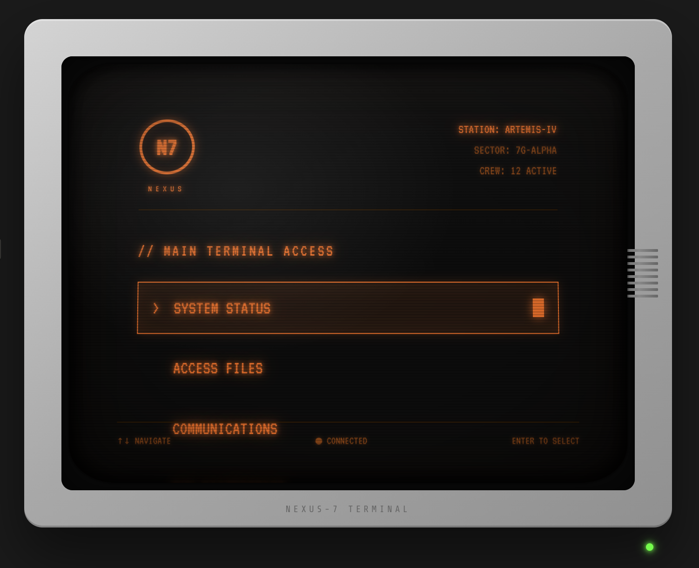

# Retro-Futuristic CRT Terminal UI
 
A React component that recreates the aesthetic of 1970s-80s computer terminals — the "Cassette Futurism" style seen in Alien (1979), Blade Runner, and games like Signalis.



## Features

- **Authentic CRT screen curvature** with elliptical border radius and layered glass effects
- **Phosphor glow** on all text via layered text-shadows (amber/orange palette)
- **Scanline overlay** using repeating CSS gradients
- **Screen vignette** darkening toward edges to simulate curved glass
- **Specular highlight** in upper-left corner mimicking light on glass
- **Random glitch effect** with hue rotation and position jitter
- **Boot sequence animation** with typewriter-style text reveal
- **Interactive menu** navigable via keyboard (↑↓ + Enter) or mouse
- **Blinking cursor** and status indicators
- **Hardware details**: beige monitor bezel, vent slots, green power LED

## Design References

The component draws inspiration from these reference images:

| Reference | Description |
|-----------|-------------|
|  | Nathan David Jones' retrofuturistic UI concept — note the amber-on-black palette, chunky bezels, and interactive text prompts |
|  | Branching narrative interface with "THE COMPANY" branding — demonstrates the phosphor glow and scanline effects |
|  | Retro-futuristic car advertisement showing the broader aesthetic context — angular geometry, orange/black palette, vintage-meets-future vibe |

## Installation

```bash
# Clone or copy the component into your React project
cp retro-terminal.jsx src/components/
```

## Usage

```jsx
import CRTTerminal from './components/retro-terminal';

function App() {
  return <CRTTerminal />;
}
```

## Dependencies

- React 18+
- Google Fonts: VT323, Share Tech Mono (loaded via CSS import)

No additional dependencies required — all effects are pure CSS.

## Customization

### Color Palette

The amber phosphor color is defined throughout the component. Key values:

```css
/* Primary amber */
#ff6a00

/* Dimmed amber for secondary text */
#994400

/* Border/divider color */
#331a00

/* Glow effect */
rgba(255, 106, 0, 0.8)  /* strong */
rgba(255, 106, 0, 0.3)  /* subtle */
```

To switch to green phosphor (like classic IBM terminals), replace with:

```css
/* Primary green */
#00ff41

/* Dimmed green */
#00802b

/* Border color */
#003311
```

### Screen Size

Modify these values in `.crt-screen`:

```css
width: 600px;
height: 450px;
```

### Curvature Intensity

Adjust the border-radius in `.crt-screen`:

```css
/* More curved (fishbowl effect) */
border-radius: 80px / 60px;

/* Less curved (flatter) */
border-radius: 30px / 25px;
```

## Technical Details

The CRT effect is achieved through multiple layered elements:

1. **Base screen** (`.crt-screen`) — dark background with curved border-radius
2. **Scanlines** (`::before` pseudo-element) — repeating 3px gradient stripes
3. **Vignette** (`::after` pseudo-element) — radial gradient darkening edges
4. **Glass overlay** (`.crt-glass`) — additional edge darkening for depth
5. **Specular highlight** (`.crt-bulge`) — light reflection on curved glass
6. **Edge shadow** (`.edge-shadow`) — inset shadows reinforcing curve illusion
7. **Reflection** (`.reflection`) — subtle top highlight

The content sits inside a 3D-transformed container (`.screen-warp`) with perspective to add subtle depth.

## Browser Support

Tested on modern browsers (Chrome, Firefox, Safari, Edge). The CSS effects use standard properties with no vendor prefixes required.

## License

MIT — do whatever you want with it.

## Credits

Design inspired by the work of [Nathan David Jones](https://www.artstation.com/nathandjones) and the broader cassette futurism aesthetic movement.